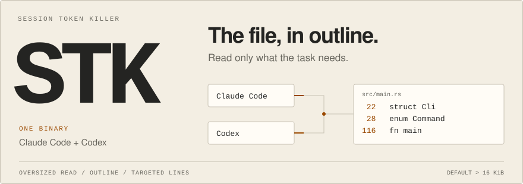

<!-- readme-art: scripts/readme/build.mjs -->
<picture>
  <source media="(max-width: 500px) and (prefers-color-scheme: dark)" srcset="assets/readme/hero-narrow-dark.svg">
  <source media="(max-width: 500px)" srcset="assets/readme/hero-narrow-light.svg">
  <source media="(prefers-color-scheme: dark)" srcset="assets/readme/hero-dark.svg">
  
</picture>

**One binary for Claude Code and Codex.** STK replaces oversized file reads with line-numbered outlines, so the agent can fetch the parts it needs. Small files and scoped reads pass through.

## Install

Requires Rust and an installed client.

```bash
git clone https://github.com/ryanportfolio/STK.git
cd STK
cargo install --path .
stk init --auto
```

Setup detects client settings directories, preserves other hooks, and backs up changed files. Restart your clients afterward. **Codex also requires you to review and trust STK through `/hooks`.**

Select a client with `--claude` or `--codex`. Preview with `--dry-run`; remove STK's hooks with `--uninstall`. [Setup and configuration](docs/usage.md)

## One engine, two adapters

| Client | Reads intercepted | Repeated large reads |
| --- | --- | --- |
| [Claude Code](src/hook.rs) | Native `Read` calls | Unchanged files get a short note; scoped reads still work. |
| [Codex](src/codex.rs) | Simple `cat`, `rtk read`, and `Get-Content` calls | Returns the outline again, preserving access across subagents and compaction. |

Codex passes through pipelines, scripts, interpolation, multiple paths, and unfamiliar flags. STK passes through files it cannot analyze. [Exact coverage](docs/usage.md#codex-coverage)

## Use it

Hooks work automatically after setup. The same binary also gives you direct access:

```bash
stk outline src/main.rs
stk read src/main.rs --offset 1 --limit 40
stk gain
```

Either `--offset` or `--limit` bypasses outlining. `--offset 1` returns the whole file. [All commands](docs/usage.md#usage)

## Verified behavior

The **same release build** was exercised through the actual Claude Code and Codex CLIs on Windows. Each client received an outline for a whole-file read, then recovered the requested lines. The tests used local scripted model endpoints; they establish hook behavior, not net session savings.

[Read the verification record](docs/dual-client-verification.md)  /  [Run the tests](docs/usage.md#build-and-test)  /  [Design specification](SPEC.md)

`stk gain` reports an upper bound on bytes avoided. Follow-up reads cost tokens, and direct `stk read` calls are not included. macOS and Linux runtime behavior has not yet been verified.

STK complements [RTK](https://github.com/rtk-ai/rtk): STK outlines file reads; RTK filters other command output.

[MIT license](LICENSE)
